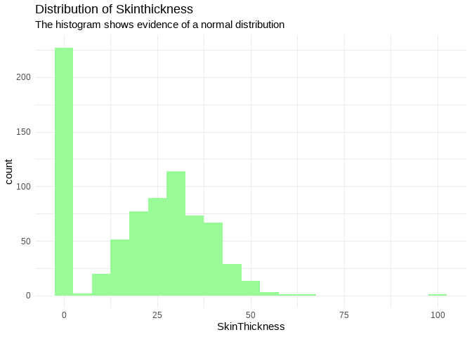
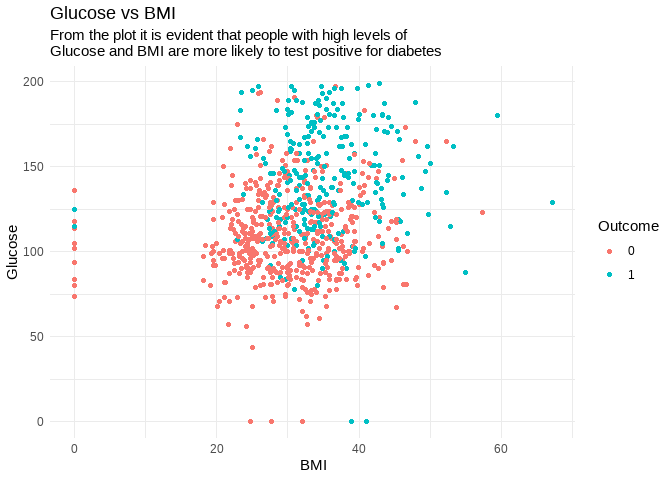
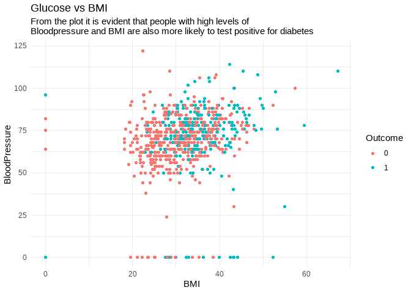
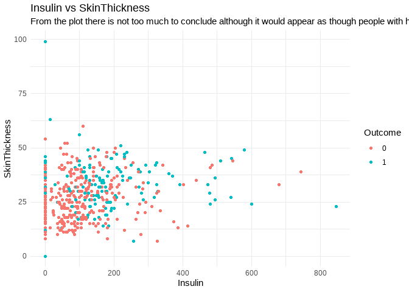

# **DIABETES PREDICTION USING MACHINE LEARNING**

## BUSINESS UNDERSTANDING

### Problem statement

Diabetes is a chronic health condition that affects millions of
individuals worldwide, posing significant challenges to their well-being
and straining healthcare systems. Early diagnosis and proactive
management are essential to mitigate the adverse effects of diabetes and
improve patients’ quality of life. Furthermore, healthcare providers and
systems need efficient tools to allocate resources effectively and
provide timely interventions for individuals at risk of diabetes.
Failure to address diabetes prediction and prevention can lead to
increased healthcare costs, reduced patient outcomes, and a burden on
healthcare infrastructure, akin to the plight of Blockbuster in the face
of changing market dynamics.

> To address these issues, there is a compelling need for the
> development of a robust and accurate diabetes prediction system. Such
> a system would leverage patient data, including medical history,
> lifestyle factors, and genetic markers, to forecast the likelihood of
> an individual developing diabetes in the near future. By identifying
> high-risk individuals and providing targeted interventions, healthcare
> providers can offer personalized care, improve patient outcomes, and
> reduce the overall societal burden of diabetes.

This project aims to create an advanced predictive model for diabetes
risk assessment, incorporating cutting-edge machine learning techniques
and a diverse range of patient data sources. By doing so, we seek to
empower healthcare professionals with a powerful tool that can help
prevent and manage diabetes more effectively, ultimately reducing the
prevalence of this chronic disease and its associated complications.
Just as Blockbuster’s failure to adapt to evolving market conditions led
to its downfall, neglecting the importance of diabetes prediction and
prevention could lead to detrimental consequences in healthcare,
including increased costs and diminished patient well-being.

### Main objective

The main objective of the project is to come up with a predictive model
that is able to identify with high precision a patient who is likely to
at risk of developing diabetes

### Metric for success

The project will be considered a success if the prediction model
developed has an accuracy of above **90%** and a recall of above
**80%**.

## DATA UNDERSTANDING

This dataset contains `768` data points and `9` columns. Columns contain
different information on subjects such as the number of pregnancies,
glucose level, blood pressure, skin thickness, insulin, Body Mass Index,
diabetes pedigree , age and the outcome which is the target variable.

``` r
# Loading all the required libraries 

library(tidyverse)
library(caret)
library(MLmetrics)
library(dlookr)
library(ROSE)
library(corrplot)
```

``` r
# Reading in the data and checking the first few rows 

df = read_csv("diabetes.csv")

df %>% head()
```

    ## # A tibble: 6 x 9
    ##   Pregnancies Glucose BloodPressure SkinThickness Insulin   BMI DiabetesPedigre~
    ##         <dbl>   <dbl>         <dbl>         <dbl>   <dbl> <dbl>            <dbl>
    ## 1           6     148            72            35       0  33.6            0.627
    ## 2           1      85            66            29       0  26.6            0.351
    ## 3           8     183            64             0       0  23.3            0.672
    ## 4           1      89            66            23      94  28.1            0.167
    ## 5           0     137            40            35     168  43.1            2.29 
    ## 6           5     116            74             0       0  25.6            0.201
    ## # ... with 2 more variables: Age <dbl>, Outcome <dbl>

``` r
# checking the last few rows of the dataset 

df %>% tail()
```

    ## # A tibble: 6 x 9
    ##   Pregnancies Glucose BloodPressure SkinThickness Insulin   BMI DiabetesPedigre~
    ##         <dbl>   <dbl>         <dbl>         <dbl>   <dbl> <dbl>            <dbl>
    ## 1           9      89            62             0       0  22.5            0.142
    ## 2          10     101            76            48     180  32.9            0.171
    ## 3           2     122            70            27       0  36.8            0.34 
    ## 4           5     121            72            23     112  26.2            0.245
    ## 5           1     126            60             0       0  30.1            0.349
    ## 6           1      93            70            31       0  30.4            0.315
    ## # ... with 2 more variables: Age <dbl>, Outcome <dbl>

``` r
# checking the columns, rows and records of the dataset 

glimpse(df)
```

    ## Rows: 768
    ## Columns: 9
    ## $ Pregnancies              <dbl> 6, 1, 8, 1, 0, 5, 3, 10, 2, 8, 4, 10, 10, 1, ~
    ## $ Glucose                  <dbl> 148, 85, 183, 89, 137, 116, 78, 115, 197, 125~
    ## $ BloodPressure            <dbl> 72, 66, 64, 66, 40, 74, 50, 0, 70, 96, 92, 74~
    ## $ SkinThickness            <dbl> 35, 29, 0, 23, 35, 0, 32, 0, 45, 0, 0, 0, 0, ~
    ## $ Insulin                  <dbl> 0, 0, 0, 94, 168, 0, 88, 0, 543, 0, 0, 0, 0, ~
    ## $ BMI                      <dbl> 33.6, 26.6, 23.3, 28.1, 43.1, 25.6, 31.0, 35.~
    ## $ DiabetesPedigreeFunction <dbl> 0.627, 0.351, 0.672, 0.167, 2.288, 0.201, 0.2~
    ## $ Age                      <dbl> 50, 31, 32, 21, 33, 30, 26, 29, 53, 54, 30, 3~
    ## $ Outcome                  <dbl> 1, 0, 1, 0, 1, 0, 1, 0, 1, 1, 0, 1, 0, 1, 1, ~

## DATA CLEANING

- Checking and Dealing with missing values

- Checking for and Dealing with duplicated values

- Checking if dataset has appropriate(expected) data types for each of
  the columns

- Checking dealing with outliers

#### Checking and dealing with missing values

``` r
# checking for percentage missing values 

df %>% diagnose() %>% select(variables, missing_count, missing_percent)
```

    ## # A tibble: 9 x 3
    ##   variables                missing_count missing_percent
    ##   <chr>                            <int>           <dbl>
    ## 1 Pregnancies                          0               0
    ## 2 Glucose                              0               0
    ## 3 BloodPressure                        0               0
    ## 4 SkinThickness                        0               0
    ## 5 Insulin                              0               0
    ## 6 BMI                                  0               0
    ## 7 DiabetesPedigreeFunction             0               0
    ## 8 Age                                  0               0
    ## 9 Outcome                              0               0

For the dataset, it looks like there are no missing values

#### Checking for duplicated values

``` r
# checking for duplicated values 

df %>% duplicated() %>% sum()
```

    ## [1] 0

The dataset does not have any duplicated values.

#### Checking if dataset has the expected data types

``` r
# checking data types 

df %>% diagnose() %>%  select(variables, types)
```

    ## # A tibble: 9 x 2
    ##   variables                types  
    ##   <chr>                    <chr>  
    ## 1 Pregnancies              numeric
    ## 2 Glucose                  numeric
    ## 3 BloodPressure            numeric
    ## 4 SkinThickness            numeric
    ## 5 Insulin                  numeric
    ## 6 BMI                      numeric
    ## 7 DiabetesPedigreeFunction numeric
    ## 8 Age                      numeric
    ## 9 Outcome                  numeric

All expect the `Outcome` variable has the expected data types. The
outcome variable should be converted to a factor with `1` representing
presence of diabetes and `0` representing no diabetes.

``` r
# changing the data type of the outcome variable

df <- df %>%  mutate(Outcome = as_factor(Outcome))
```

#### Checking for outliers

``` r
# checking for outliers 

df %>% diagnose_outlier()
```

    ## # A tibble: 8 x 6
    ##   variables     outliers_cnt outliers_ratio outliers_mean with_mean without_mean
    ##   <chr>                <int>          <dbl>         <dbl>     <dbl>        <dbl>
    ## 1 Pregnancies              4          0.521         15        3.85         3.79 
    ## 2 Glucose                  5          0.651          0      121.         122.   
    ## 3 BloodPressure           45          5.86          19.2     69.1         72.2  
    ## 4 SkinThickness            1          0.130         99       20.5         20.4  
    ## 5 Insulin                 34          4.43         457.      79.8         62.3  
    ## 6 BMI                     19          2.47          23.7     32.0         32.2  
    ## 7 DiabetesPedi~           29          3.78           1.54     0.472        0.430
    ## 8 Age                      9          1.17          70       33.2         32.8

Although there is evidence of outliers, the algorithm used
`randomforest model` deals with outliers as aggregates predictions from
many decision trees therefore removing any potential biases that would
arise from outliers

``` r
df %>% summary()
```

    ##   Pregnancies        Glucose      BloodPressure    SkinThickness  
    ##  Min.   : 0.000   Min.   :  0.0   Min.   :  0.00   Min.   : 0.00  
    ##  1st Qu.: 1.000   1st Qu.: 99.0   1st Qu.: 62.00   1st Qu.: 0.00  
    ##  Median : 3.000   Median :117.0   Median : 72.00   Median :23.00  
    ##  Mean   : 3.845   Mean   :120.9   Mean   : 69.11   Mean   :20.54  
    ##  3rd Qu.: 6.000   3rd Qu.:140.2   3rd Qu.: 80.00   3rd Qu.:32.00  
    ##  Max.   :17.000   Max.   :199.0   Max.   :122.00   Max.   :99.00  
    ##     Insulin           BMI        DiabetesPedigreeFunction      Age       
    ##  Min.   :  0.0   Min.   : 0.00   Min.   :0.0780           Min.   :21.00  
    ##  1st Qu.:  0.0   1st Qu.:27.30   1st Qu.:0.2437           1st Qu.:24.00  
    ##  Median : 30.5   Median :32.00   Median :0.3725           Median :29.00  
    ##  Mean   : 79.8   Mean   :31.99   Mean   :0.4719           Mean   :33.24  
    ##  3rd Qu.:127.2   3rd Qu.:36.60   3rd Qu.:0.6262           3rd Qu.:41.00  
    ##  Max.   :846.0   Max.   :67.10   Max.   :2.4200           Max.   :81.00  
    ##  Outcome
    ##  0:500  
    ##  1:268  
    ##         
    ##         
    ##         
    ## 

## EXPLORATORY DATA ANALYSIS

### UNIVARIATE ANALYSIS

``` r
ggplot(df, aes(Glucose))+
  geom_histogram(binwidth = 20, fill="lightsalmon") +
  labs(title = "Distribution of Glucose", 
       subtitle = "The histogram shows evidence of a normal distribution") +
  theme_minimal()
```

<!-- -->

``` r
ggplot(df, aes(Pregnancies))+
  geom_histogram(binwidth = 1, fill="darkkhaki") +
  labs(title = "Distribution of Pregnancies", 
       subtitle = "The histogram shows evidence of a positive skewness") +
  theme_minimal()
```

<!-- -->

``` r
ggplot(df, aes(BloodPressure))+
  geom_histogram(binwidth = 5, fill="plum") +
  labs(title = "Distribution of BloodPressure", 
       subtitle = "The histogram shows evidence of a normal distribution") +
  theme_minimal()
```

<!-- -->

``` r
ggplot(df, aes(SkinThickness))+
  geom_histogram(binwidth = 5, fill="palegreen") +
  labs(title = "Distribution of Skinthickness",
       subtitle = "The histogram shows evidence of a normal distribution") +
  theme_minimal()
```

<!-- -->

``` r
ggplot(df, aes(Insulin))+
  geom_histogram(binwidth = 50, fill="lightseagreen")+
  labs(title = "Distribution of Glucose", 
       subtitle = "The histogram shows evidence of positive skewness") +
  theme_minimal()
```

<!-- -->

``` r
ggplot(df, aes(BMI))+
  geom_histogram(binwidth = 5,fill="chocolate") +
  labs(title = "Distribution of BMI",
       subtitle = "The histogram shows evidence of a normal distribution") +
  theme_minimal()
```

<!-- -->

``` r
ggplot(df, aes(DiabetesPedigreeFunction))+
  geom_histogram(binwidth = 0.25,fill="goldenrod") +
  labs(title = "Distribution of DiabetesPedigreeFunction",
       subtitle = "The histogram shows evidence positive skewness") +
  theme_minimal()
```

<!-- -->

``` r
ggplot(df, aes(Age))+
  geom_histogram(binwidth =5, fill="aquamarine") +
  labs(title = "Distribution of age", 
       subtitle = "The histogram shows evidence of positive skewness") +
  theme_minimal()
```

<!-- -->

``` r
pie_data <- df %>% group_by(Outcome) %>%
summarise(count = n()) %>% 
mutate(perc = round((count/sum(count)) * 100),digits=2)


ggplot(pie_data, aes(x="", y=perc, fill=Outcome)) +
  geom_bar(stat="identity", width=1) +
  coord_polar("y", start=0) +
  geom_text(aes(label = paste0(perc, "%")),
  position = position_stack(vjust=0.5)) +
  labs(x = NULL, y = NULL, fill = NULL,
  title = "Percentage Distribution Outcome", 
  subtitle = "35% tested positive for diabetes while 65% tested negative") +
  theme_classic() +
  theme(axis.line = element_blank(),
  axis.text = element_blank(),
  axis.ticks = element_blank()) +
  scale_fill_brewer(palette = "Accent")
```

<!-- -->

From the pie chart,there is evidence of class imbalance for the outcome
variable. This poses a unique challenge for the model as it will not
have enough samples from the minority class(which in this case is people
diagnosed with diabetes) to train on and may struggle to predict
correctly this class compared to the majority class.

### BIVARIATE ANALYSIS

Correlations help you understand the relationships between different
variables in your dataset. A high positive correlation between two
variables indicates that they tend to increase or decrease together,
while a high negative correlation indicates that one variable tends to
increase as the other decreases.

``` r
correlations <- df %>% select(-Outcome) %>% cor()

corrplot(correlations, method = 'number')
```

<!-- -->

Suprisingly, there are no very strong correlations between the variables
except for Pregnancies and Age which had some sort of strong
correlations as it would be expected that someone will have to live
longer to give birth to many chidren.

``` r
ggplot(df, aes(BMI, Glucose, color=Outcome))+
  geom_point()+
  labs(title = "Glucose vs BMI" , 
       subtitle = "From the plot it is evident that people with high levels of\nGlucose and BMI are more likely to test positive for diabetes" ) +
  theme_minimal()
```

<!-- -->

``` r
ggplot(df, aes(BMI, BloodPressure, color=Outcome))+
  geom_point()+
  labs(title = "Glucose vs BMI" , 
       subtitle = "From the plot it is evident that people with high levels of\nBloodpressure and BMI are also more likely to test positive for diabetes" ) +
  theme_minimal()
```

<!-- -->

``` r
ggplot(df, aes(Glucose, DiabetesPedigreeFunction, color=Outcome))+
  geom_point()+
  labs(title = "Glucose vs BMI" , 
       subtitle = "From the plot it is evident that people with high levels of\nGlucose and DiabetesPedigreefunction are also more likely to test positive for diabetes" ) +
  theme_minimal()
```

<!-- -->

``` r
ggplot(df, aes(Insulin, SkinThickness, color=Outcome))+
  geom_point()+
  labs(title = "Insulin vs SkinThickness",
       subtitle = "From the plot there is not too much to conclude although it would appear as though people with high insulin levels tend to have high levels of skin thickness especially for people diagnosed with diabetes" ) +
  theme_minimal()
```

<!-- -->

### MODELLING

``` r
# we need to drop all values where the value is zero and skin thickness

df <- df %>% 
    filter_if(is.numeric, all_vars((.) != 0)) 
```

``` r
# splitting data into training testing set

set.seed(123)
split <- createDataPartition(df$Outcome, p = .8,
                                  list = FALSE)

trainset <- df[split,]

testset <- df[-split,]
```

``` r
# preprocessing

set.seed(123)

outcome_train <- trainset %>% pull(Outcome)

outcome_test <- testset %>% pull(Outcome)

predictors_train <- trainset %>% select(-Outcome)

predictors_test <- testset %>% select(-Outcome)

preproc <- preProcess(predictors_train, method = c("center", "scale"))

train_preproc <- predict(preproc, predictors_train)

test_preproc <- predict(preproc, predictors_test)

train_preproc_df <- train_preproc %>% mutate(Outcome=outcome_train)

test_preproc_df <- test_preproc %>% mutate(Outcome = outcome_test)
```

``` r
# over-sampling the minority class to enable the model predict better

over_preproctrain_df <- ovun.sample(Outcome ~ .,data=train_preproc_df,N=360)$data
```

``` r
# training the model

# train control of the model
ctrl <- trainControl(
  method = "repeatedcv",
  repeats = 5)


# fitting a random forest model using the balanced dataset

randomforest_model <- train(
  Outcome ~ .,
  data = over_preproctrain_df,
  method = "rf",
  trControl = ctrl,
  tuneLength= 5)
```

``` r
# checking the overall performance of the model on training set

randomforest_model
```

    ## Random Forest 
    ## 
    ## 360 samples
    ##   8 predictor
    ##   2 classes: '0', '1' 
    ## 
    ## No pre-processing
    ## Resampling: Cross-Validated (10 fold, repeated 5 times) 
    ## Summary of sample sizes: 324, 324, 324, 323, 323, 324, ... 
    ## Resampling results across tuning parameters:
    ## 
    ##   mtry  Accuracy   Kappa    
    ##   2     0.9404363  0.8806297
    ##   3     0.9448666  0.8894989
    ##   5     0.9416118  0.8829573
    ##   6     0.9421523  0.8840617
    ##   8     0.9377353  0.8752726
    ## 
    ## Accuracy was used to select the optimal model using the largest value.
    ## The final value used for the model was mtry = 3.

``` r
# checking accuracy and precall of the model using confusion matrix on test set

y_pred_rf = predict(randomforest_model, newdata = test_preproc_df)

confusionMatrix(test_preproc_df$Outcome, y_pred_rf)
```

    ## Confusion Matrix and Statistics
    ## 
    ##           Reference
    ## Prediction  0  1
    ##          0 33 12
    ##          1  6 16
    ##                                          
    ##                Accuracy : 0.7313         
    ##                  95% CI : (0.609, 0.8324)
    ##     No Information Rate : 0.5821         
    ##     P-Value [Acc > NIR] : 0.008183       
    ##                                          
    ##                   Kappa : 0.4306         
    ##                                          
    ##  Mcnemar's Test P-Value : 0.238593       
    ##                                          
    ##             Sensitivity : 0.8462         
    ##             Specificity : 0.5714         
    ##          Pos Pred Value : 0.7333         
    ##          Neg Pred Value : 0.7273         
    ##              Prevalence : 0.5821         
    ##          Detection Rate : 0.4925         
    ##    Detection Prevalence : 0.6716         
    ##       Balanced Accuracy : 0.7088         
    ##                                          
    ##        'Positive' Class : 0              
    ## 

For the random forest model, the model has a
`overall accuracy of around 79%` and a recall of `84%`

``` r
# fitting a support vector machine model

svm_model <- train(
  Outcome ~ .,
  data = over_preproctrain_df,
  method = "svmRadial",
  trControl = ctrl,
  tuneLength= 5)
```

``` r
# checking the performance of the model on the training set

svm_model
```

    ## Support Vector Machines with Radial Basis Function Kernel 
    ## 
    ## 360 samples
    ##   8 predictor
    ##   2 classes: '0', '1' 
    ## 
    ## No pre-processing
    ## Resampling: Cross-Validated (10 fold, repeated 5 times) 
    ## Summary of sample sizes: 323, 324, 325, 324, 324, 324, ... 
    ## Resampling results across tuning parameters:
    ## 
    ##   C     Accuracy   Kappa    
    ##   0.25  0.8366667  0.6719781
    ##   0.50  0.8456173  0.6897676
    ##   1.00  0.8540150  0.7070744
    ##   2.00  0.8580124  0.7153437
    ##   4.00  0.8685431  0.7363528
    ## 
    ## Tuning parameter 'sigma' was held constant at a value of 0.1252854
    ## Accuracy was used to select the optimal model using the largest value.
    ## The final values used for the model were sigma = 0.1252854 and C = 4.

``` r
# checking accuracy and precall of the model using confusion matrix on test set

y_pred_svm = predict(svm_model, newdata = test_preproc_df)

confusionMatrix(test_preproc_df$Outcome, y_pred_svm)
```

    ## Confusion Matrix and Statistics
    ## 
    ##           Reference
    ## Prediction  0  1
    ##          0 34 11
    ##          1  7 15
    ##                                          
    ##                Accuracy : 0.7313         
    ##                  95% CI : (0.609, 0.8324)
    ##     No Information Rate : 0.6119         
    ##     P-Value [Acc > NIR] : 0.02793        
    ##                                          
    ##                   Kappa : 0.418          
    ##                                          
    ##  Mcnemar's Test P-Value : 0.47950        
    ##                                          
    ##             Sensitivity : 0.8293         
    ##             Specificity : 0.5769         
    ##          Pos Pred Value : 0.7556         
    ##          Neg Pred Value : 0.6818         
    ##              Prevalence : 0.6119         
    ##          Detection Rate : 0.5075         
    ##    Detection Prevalence : 0.6716         
    ##       Balanced Accuracy : 0.7031         
    ##                                          
    ##        'Positive' Class : 0              
    ## 

The support vector machine model performs poorly on the test set
compared to the random forest with an accuracy of `65%` and a recall of
`75%`

In this case the `xgboost model` will be saved to be deployed an shiny
app with an interactive user interface.

### SAVING THE MODEL AS A RDS OBJECT FOR USE IN SHINY APP

``` r
# saving the model as a RDS object

write_rds(randomforest_model, "randomforest_model.rds")
```
